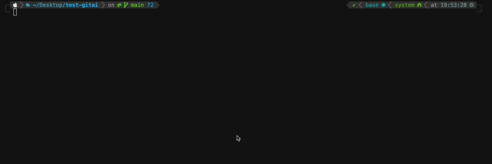
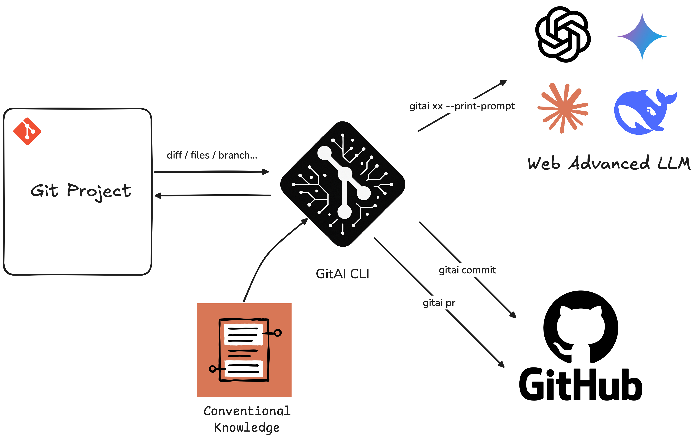

<h1 align="center">GitAI CLI</h1>
<p align="center">Smart CLI for AI-driven Git commit & PR generation.</p>

<p align="center"><code>npm i -g @lastwhisper-dev/gitai-cli</code></p>



<video src="https://github.com/user-attachments/assets/f8151846-9825-409a-a99f-fa5103246d22" width="320" height="240" controls>
</video>

[](https://opensource.org/licenses/MIT)

A vibe-coding project. ✨



> [!Note]
>
> **GitAI CLI is your intelligent Git assistant, supercharging your workflow with AI-powered command generation. Craft perfect commit messages and pull request descriptions in seconds!**

> [!Tip]
>
> For Chinese version, please refer to [中文文档](./README_CN.md)

## ✨ Why GitAI CLI?

Tired of spending precious time crafting the perfect commit messages or pull request descriptions? GitAI CLI leverages the power of Large Language Models (LLMs) to automate these tasks, directly from your terminal.

- **One command, zero context-switch** – `gitai commit` and `gitai pr` read your diff / file-tree / branch info and craft Conventional-Commit messages or full PR drafts automatically.  
- **Customizable Prompts**: Unlike GitHub Copilot's more rigid suggestions, GitAI CLI allows you to define your own prompt templates (**global or project-level**). We provide defaults based on the widely adopted [Conventional Commits specification](https://www.conventionalcommits.org/en/v1.0.0/), ensuring your commit history is clean, explicit, and machine-readable.
- **Seamless Integration**: Forget manually copying and pasting. Compared to tools like Cursor's command+k, GitAI CLI integrates directly into your Git workflow. Generate and (optionally) apply suggestions with a single command.
- **Multi-Provider Support (including Local LLM)**: Configure GitAI to use OpenAI, Gemini, Grok, DeepSeek, Ollama, or other compatible LLM providers. With Ollama, you can run entirely local models for maximum privacy and offline capability.

## 🚀 Quick start

### Install from npm

```bash
# 1. Install (latest Node 18+ required)
npm i -g @lastwhisper-dev/gitai-cli               # OR: pnpm add -g @lastwhisper-dev/gitai-cli

# 2. Bootstrap a repo
cd ~/my-project
gitai init                       # creates .gitai/ with default config & .env-example

# 3. Add your keys  ➜  copy .env-example > .env  and fill the blanks
cp .env-example .env

# 4. Use show-config to verify your config
gitai show-config

# 5. Create some changes, stage them, then…
git add .
gitai commit -n 3                # returns 3 commit-message suggestions

# 6. Open a feature branch, then…
gitai pr -t main                 # writes .gitai/pr_docs/<ts>-feature.md
```

> [!Tip]
>
> If you have permission issues, try:
>
> ```bash
> # For macOS & Linux
> sudo npm i -g @lastwhisper-dev/gitai-cli
> # For Windows, use PowerShell/CMD in admin mode
> ```
>
> If you have network issues, try:
>
> ```bash
> npm config set registry https://registry.npmmirror.com
> ```

### Install from source

```bash
git clone https://github.com/keli-wen/gitai-cli.git
cd gitai-cli
npm run build && npm link        # global symlink for development
```

Now you can use `gitai` commands anywhere on your system.

### Configuration

1. **Set up API Keys (Environment Variables):**

   GitAI CLI needs API keys for the LLM providers you intend to use. Create a `.env` file in your project root or set these globally in your shell environment. See `.env-example` for a template (created by `gitai init`):

   ```env
   OPENAI_API_KEY="Your OpenAI API Key"
   OPENAI_BASE_URL=https://api.openai.com/v1

   DEEPSEEK_API_KEY="Your DeepSeek API Key"
   DEEPSEEK_BASE_URL=https://api.deepseek.com

   GEMINI_API_KEY="Your Gemini API Key"
   GEMINI_BASE_URL=https://generativelanguage.googleapis.com

   GROK_API_KEY="Your Grok API Key"
   GROK_BASE_URL=https://api.x.ai/v1

   OLLAMA_BASE_URL="Your Ollama Base URL"

   # If you want to use a proxy, you can set the following environment variables
   # HTTPS_PROXY="Your Proxy URL" # or HTTP_PROXY, ALL_PROXY
   ```

2. **Initialize GitAI Configuration:**

   Navigate to your Git project's root directory and run:

   ```bash
   gitai init
   ```

   This creates a `.gitai/config.yaml` file with default settings. You can customize:

   - Default LLM provider and model.
   - Specific providers/models for `commit` and `pr` commands.
   - Prompt template paths.
   - Behavior for `gitai commit / gitai pr` (e.g., base branch, file tree inclusion).

   Example `config.yaml` snippet:

   ```yaml
   llm:
       default:
           provider: openai
           model: gpt-4o-mini
           apiKeyEnvVar: 'OPENAI_API_KEY'
           baseUrlEnvVar: 'OPENAI_BASE_URL'
           temperature: 0.7
       commands:
           commit:
               # provider: deepseek # Example: Override for commit
               # model: deepseek-chat
               # apiKeyEnvVar: 'DEEPSEEK_API_KEY'
   # ... other configurations
   ```

   You can also initialize from the global config (`~/.gitai/config.yaml`) or with default templates:

   ```bash
   gitai init --from-global
   gitai init --from-default --force # Overwrites existing local config
   ```

## Features

- **`gitai commit`**:
  - Automatically generates commit messages based on your staged changes.
  - Provides multiple suggestions for you to choose from.
  - Adheres to [Conventional Commits](https://www.conventionalcommits.org/en/v1.0.0/) format by default.
  - Allows custom prompts for tailored message styles.
- **`gitai pr`**:
  - Generates comprehensive Pull Request titles and descriptions.
  - Analyzes differences between your current branch and a target branch.
  - Can include a snapshot of the project's file tree for better context.
- **Flexible Configuration**:
  - Project-level (`./.gitai/config.yaml`) or global (`~/.gitai/config.yaml`) settings.
  - Easily switch LLM providers (OpenAI, DeepSeek, Ollama) and models.
  - Customize temperature, API keys (via environment variables), and base URLs.
- **Print Prompt Option**: See the exact prompt sent to the AI for debugging or using with **web-based AI interfaces** (`--print-prompt`).

## 💡 Usage


The general command structure is:

```bash
gitai [command] [options]
```

### Global Options

- `-v, --verbose`: Enable verbose logging.
- `-q, --quiet`: Suppress non-error logs.

### `init`

Initialize GitAI CLI configuration in your project.

```bash
gitai init [options]
```

**Options:**

- `-f, --force`: Overwrite existing configuration if it exists.
- `--from-global`: Use configuration from your home directory (`~/.gitai`).
- `--from-default`: Use default template configuration.

**Example:**

```bash
gitai init --force
```

### `commit`

Generate AI-powered commit messages for staged changes.

```bash
gitai commit [options]
```

**Options:**

- `-p, --prompt <message>`: Additional instructions to guide the AI.
- `-n, --suggestions <number>`: Number of suggestions to generate (overrides config).
- `--print-prompt`: Print the AI prompt instead of calling the model.

**Examples:**

```bash
# Generate commit messages for staged files
gitai commit

# Provide extra context to the AI
gitai commit -p "Focus on the refactoring of the user service"

# Get 5 suggestions
gitai commit -n 5

# Copy the prompt to clipboard (macOS example) for use with a web AI
gitai commit --print-prompt | pbcopy
```

### `pr`

Generate a Pull Request title & body from the current branch diff.

```bash
gitai pr [options]
```

**Options:**

- `-p, --prompt <text>`: Additional instructions to guide the AI.
- `-t, --target <branch>`: Target branch to diff against (defaults to `main` or as per config).
- `-u, --unstaged`: Include unstaged changes in the diff.
- `--no-tree`: Exclude file tree snapshot from the AI context.
- `--print-prompt`: Print the AI prompt instead of calling the model.

**Examples:**

```bash
# Generate PR description for current branch against default target
gitai pr

# Specify a target branch
gitai pr --target develop

# Add a custom instruction for the PR description
gitai pr -p "This PR also addresses a minor UI glitch in the login form."

# Include unstaged changes and copy the prompt (macOS example)
gitai pr -u --print-prompt | pbcopy
```

### `show-config`

Show resolved config path and content.

```bash
gitai show-config [options]
```

**Options:**

- `-p, --path-only`: Print current config path only.

**Examples:**

```bash
# Display the full resolved configuration
gitai show-config

# Show only the path to the active configuration file
gitai show-config --path-only
```

## Future Features

I constantly thinking of ways to make GitAI CLI even more powerful. Here are some ideas on my radar:

### `gitai query`

```bash
gitai query --prompt "xxx"
```

Enable direct queries to the AI about your Git repository. The system prompt will automatically include contextual information like:

- All local and remote branches.

- Current branch name.

- Recent Git log (last 10 commits).

- Current `git status`.

This allows for natural language questions like *What were the last few features merged into main?* or *Summarize changes on the feature/xyz branch.*

### `gitai context`

Export project information (diff, file tree, etc.) as **AI-friendly context** in Markdown or JSON format. This command would make it easy to gather relevant information for manual use with **external AI models** or for debugging.
Key context to include:

1. Current `git diff` (staged, working directory, or between specified commits).
2. Project file structure (filterable by depth, size, extension).
3. Potentially: `package.json` dependencies, current branch name, recent commit history.

## 🤝 Contributing

Contributions are welcome and greatly appreciated! Whether it's bug reports, feature suggestions, or code contributions, every bit helps.

**Quick Development Setup:**

1. Fork → `git clone` → `npm i`
2. Follow **Conventional Commits** for every PR.
3. `npm run lint && npm test` must stay green.
4. Use `npm link` to test the CLI globally during development.
5. Open a PR.

## License

[MIT](./LICENSE)
