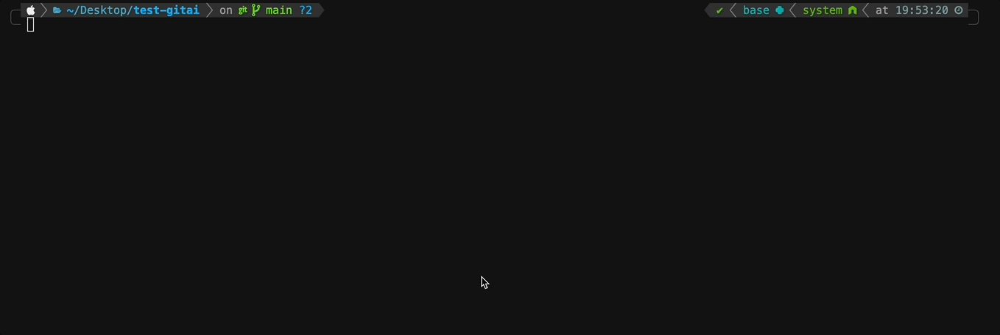
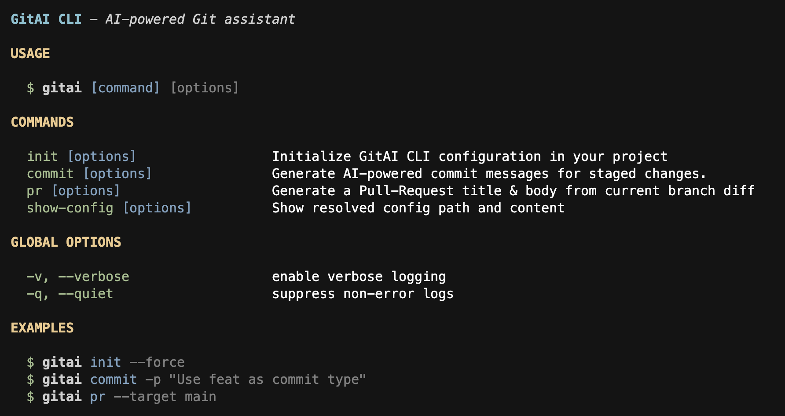

<h1 align="center">GitAI CLI</h1>
<p align="center">Smart CLI for AI-driven Git commit & PR generation.</p>

<p align="center"><code>npm i -g @lastwhisper-dev/gitai-cli</code></p>



<video src="https://github.com/user-attachments/assets/f8151846-9825-409a-a99f-fa5103246d22" width="320" height="240" controls>
</video>

[](https://opensource.org/licenses/MIT)

A vibe-coding project. ✨


> [!Note]
>
> **GitAI CLI 是你的智能 Git 助手，通过 AI 驱动的命令生成，为你的工作流超级加速。在几秒钟内打造完美的提交信息和拉取请求描述！**


> [!Tip]
>
> 如果要查看英文文档，请参考 [README.md](./README.md)

## ✨ 为何选择 GitAI CLI？

你是否厌倦了花费宝贵时间精心编写提交信息或拉取请求描述？GitAI CLI 利用大语言模型 (LLM) 的强大功能，直接从你的终端自动化这些任务。

- **一键搞定，无需切换上下文** – `gitai commit` 和 `gitai pr` 会自动读取你的 diff / 文件树 / 分支信息，并生成符合 Conventional-Commit 规范的消息或完整的 PR 草稿。
- **可自定义提示词**：与 GitHub Copilot 相对固定的建议不同，GitAI CLI 允许你定义自己的提示词模板（**全局或项目级别**）。我们提供基于广泛采用的 [Conventional Commits 规范](https://www.conventionalcommits.org/en/v1.0.0/) 的默认模板，确保你的提交历史清晰、明确且机器可读。
- **无缝集成**：告别手动复制粘贴。与 Cursor 的 command+k 等工具相比，GitAI CLI 直接集成到你的 Git 工作流中。只需一个命令即可生成并（可选地）应用建议。
- **多模型提供商支持（包括本地 LLM）**：配置 GitAI 以使用 OpenAI、Gemini、Grok、DeepSeek、Ollama 或其他兼容的 LLM 提供商。通过 Ollama，你可以完全在本地运行模型，以实现最大的隐私保护和离线功能。

## 🚀 快速开始

### 通过 npm 安装

```bash
# 1. 安装 (需要 Node 18+ 最新版本)
npm i -g @lastwhisper-dev/gitai-cli               # 或: pnpm add -g @lastwhisper-dev/gitai-cli

# 2. 初始化一个仓库
cd ~/my-project
gitai init                       # 会创建包含默认配置的 .gitai/ 目录 & .env-example 文件

# 3. 添加你的密钥  ➜  复制 .env-example 为 .env 并填写
cp .env-example .env

# 4. 使用 show-config 验证配置
gitai show-config

# 5. 创建一些更改，暂存它们，然后…
git add .
gitai commit -n 3                # 返回 3 条提交信息建议

# 6. 创建一个特性分支，然后…
gitai pr -t main                 # 会将 PR 内容写入 .gitai/pr_docs/<ts>-feature.md
```

> [!Tip]
>
> 如果你有权限问题，可以尝试：
>
> ```bash
> # For macOS & Linux
> sudo npm i -g @lastwhisper-dev/gitai-cli
> # For Windows, use PowerShell/CMD in admin mode
> ```
>
> 如果你有网络问题，可以尝试：
>
> ```bash
> npm config set registry https://registry.npmmirror.com
> ```

### 从源码安装

```bash
git clone https://github.com/keli-wen/gitai-cli.git
cd gitai-cli
npm run build && npm link        # 创建全局符号链接以方便开发
```

现在你可以在系统的任何地方使用 `gitai` 命令了。

### 配置

1. **设置 API 密钥 (环境变量)：**

   GitAI CLI 需要你计划使用的 LLM 提供商的 API 密钥。在你的项目根目录创建一个 `.env` 文件，或者在你的 Shell 环境中全局设置这些变量。请参考 `.env-example` 文件作为模板（`gitai init` 会自动创建）：

   ```env
   # OpenAI 配置
   OPENAI_API_KEY="你的 OpenAI API 密钥"
   OPENAI_BASE_URL=https://api.openai.com/v1
   
   # DeepSeek 配置
   DEEPSEEK_API_KEY="你的 DeepSeek API 密钥"
   DEEPSEEK_BASE_URL=https://api.deepseek.com
   
   # Gemini 配置
   GEMINI_API_KEY="你的 Gemini API 密钥"
   GEMINI_BASE_URL=https://generativelanguage.googleapis.com

   # Grok 配置
   GROK_API_KEY="你的 Grok API 密钥"
   GROK_BASE_URL=https://api.x.ai/v1
   
   # Ollama 配置 (通常在本地运行)
   OLLAMA_BASE_URL="你的 Ollama Base URL" # 默认值，可在配置中覆盖
   
   # 可选: 代理设置
   # HTTPS_PROXY="你的代理 URL" # or HTTP_PROXY, ALL_PROXY
   ```

    如果你想在任何项目中轻松使用 `gitai`，你可以在你的 shell 配置文件（例如 `.zshrc` 或 `.bashrc`）中设置环境变量：

    ```bash
    export OPENAI_API_KEY="Your OpenAI API Key"
    export OPENAI_BASE_URL="https://api.openai.com/v1"
    ```

2.  **初始化 GitAI 配置：**

    导航到你的 Git 项目根目录并运行：

    ```bash
    gitai init
    ```

    这会在项目下创建 `.gitai/config.yaml` 文件，包含默认设置。你可以自定义：

    -   默认 LLM 提供商和模型。
    -   为 `commit` 和 `pr` 命令指定特定的提供商/模型。
    -   提示词模板路径。
    -   `gitai commit / gitai pr` 的行为（例如，基础分支，是否包含文件树）。

    `config.yaml` 配置示例片段：

    ```yaml
    llm:
        default:
            provider: openai
            model: gpt-4o-mini
            apiKeyEnvVar: 'OPENAI_API_KEY'
            baseUrlEnvVar: 'OPENAI_BASE_URL'
            temperature: 0.7
        commands:
            commit:
                # provider: deepseek # 示例：为 commit 命令覆盖配置
                # model: deepseek-chat
                # apiKeyEnvVar: 'DEEPSEEK_API_KEY'
    # ... 其他配置
    ```

    你也可以从全局配置 (`~/.gitai/config.yaml`) 或使用默认模板初始化：

    ```bash
    gitai init --from-global
    gitai init --from-default --force # 会覆盖已存在的本地配置
    ```

## 主要功能

-   **`gitai commit`**：
    -   根据你暂存的更改自动生成提交信息。
    -   提供多个建议供你选择（默认 3 个）。
    -   默认遵循 [Conventional Commits 规范](https://www.conventionalcommits.org/en/v1.0.0/) 格式。
    -   允许使用**自定义提示词**来定制消息风格。
-   **`gitai pr`**：
    -   生成全面的拉取请求标题和描述。
    -   分析当前分支与目标分支之间的差异。
    -   可以包含项目文件树的快照以提供更好的上下文。
-   **灵活配置**：
    -   项目级别 (`./.gitai/config.yaml`) 或全局 (`~/.gitai/config.yaml`) 配置。
    -   轻松切换 LLM 提供商 (OpenAI, DeepSeek, Ollama) 和模型。
    -   自定义温度、API 密钥（通过环境变量）和基础 URL。
-   **打印提示词选项**：查看发送给 AI 的确切提示词，用于调试或配合**基于 Web 的 AI 界面**使用 (`--print-prompt`)。

## 💡 使用方法



基本命令结构如下：

```bash
gitai [命令] [选项]
```

### 全局选项

-   `-v, --verbose`：启用详细日志。
-   `-q, --quiet`：禁止输出非错误日志。

### `init`

在你的项目中初始化 GitAI CLI 配置。

```bash
gitai init [选项]
```

**选项：**

-   `-f, --force`：如果配置文件已存在，则强制覆盖。
-   `--from-global`：使用你主目录 (`~/.gitai`) 中的配置。
-   `--from-default`：使用默认模板配置。

**示例：**

```bash
gitai init --force
```

### `commit`

为暂存的更改生成 AI 驱动的提交信息。

```bash
gitai commit [选项]
```

**选项：**

-   `-p, --prompt <message>`：给 AI 的额外指令。
-   `-n, --suggestions <number>`：生成的建议数量（会覆盖配置中的设置）。
-   `--print-prompt`：打印 AI 提示词，而不是调用模型。

**示例：**

```bash
# 为暂存文件生成提交信息
gitai commit

# 为 AI 提供额外上下文
gitai commit -p "重点关注用户服务的重构"

# 获取 5 条建议
gitai commit -n 5

# (macOS 示例) 复制提示词到剪贴板，以便在网页版 AI 中使用
gitai commit --print-prompt | pbcopy
```

### `pr`

从当前分支的 diff 生成拉取请求的标题和正文。

```bash
gitai pr [选项]
```

**选项：**

-   `-p, --prompt <text>`：给 AI 的额外指令。
-   `-t, --target <branch>`：进行 diff 的目标分支（默认为 `main` 或根据配置）。
-   `-u, --unstaged`：在 diff 中包含未暂存的更改。
-   `--no-tree`：从 AI 上下文中排除文件树快照。
-   `--print-prompt`：打印 AI 提示词，而不是调用模型。

**示例：**

```bash
# 为当前分支针对默认目标分支生成 PR 描述
gitai pr

# 指定一个目标分支
gitai pr --target develop

# 为 PR 描述添加自定义说明
gitai pr -p "此 PR 还修复了登录表单中的一个次要 UI 问题。"

# (macOS 示例) 包含未暂存的更改并复制提示词
gitai pr -u --print-prompt | pbcopy
```

### `show-config`

显示解析后的配置路径和内容。

```bash
gitai show-config [选项]
```

**选项：**

-   `-p, --path-only`：仅打印当前配置文件的路径。

**示例：**

```bash
# 显示完整的解析后配置
gitai show-config

# 仅显示当前活动配置文件的路径
gitai show-config --path-only
```

## 未来功能展望

我一直在思考如何让 GitAI CLI 更加强大。以下是我正在考虑的一些想法：

### `gitai query`

```bash
gitai query --prompt "xxx"
```

允许直接向 AI 查询你的 Git 仓库信息。系统提示词将自动包含上下文信息，例如：

-   所有本地和远程分支。
-   当前分支名称。
-   最近的 Git 日志（最后 10 条提交）。
-   当前的 `git status`。

这样你就可以用自然语言提问，例如：“最近合并到 main 分支的几个功能是什么？”或“总结一下 feature/xyz 分支上的更改。”

### `gitai context`

将项目信息（如 diff、文件树等）导出为 **AI 友好的上下文**，支持 Markdown 或 JSON 格式。此命令可以方便地收集相关信息，以便手动与**外部 AI 模型**配合使用或进行调试。
关键上下文包括：

1.  当前的 `git diff` （暂存区、工作目录或指定提交之间）。
2.  项目文件结构（可按深度、大小、扩展名筛选）。
3.  可能还包括：`package.json` 依赖项、当前分支名称、最近的提交历史。

## 🤝 贡献

欢迎并非常感谢各种形式的贡献！无论是 Bug 报告、功能建议还是代码贡献，每一点帮助都至关重要。

**快速开发设置：**

1.  Fork → `git clone` → `npm i`
2.  每次 PR 都遵循 **Conventional Commits** 规范。
3.  `npm run lint && npm test` 必须保持通过 (stay green)。
4.  在开发过程中使用 `npm link` 全局测试 CLI。
5.  提交 Pull Request。

## 许可证

[MIT](./LICENSE)